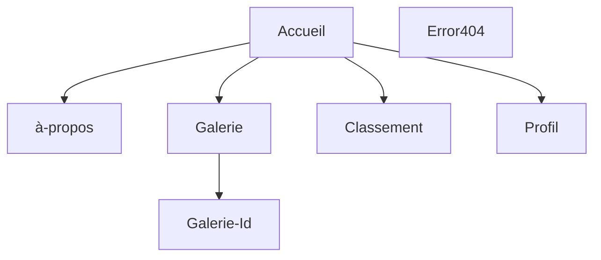

## 🚀 Bienvenue sur notre projet 3 réalisé à la Wild Code School  

## 💡 Le concept

Nous devons réaliser un application qui permet d'ajouter des street art en se servant de la localisation.

## 🛠️ Fonctionnalités:

### 👥 Partie Visiteur:

- L'utilisateur pourra s'inscire ou se connecter.
- L'utilisateur pourra se situer sur une carte interactive et voir les oeuvres de street art autour de lui.
- L'utilisateur pourra accéder aux pages instructions, et au classement général.

### 🔒 Partie Utilisateur connecté:

- L'utilisateur pourra se déconnecter.
- L'utilisateur pourra modifier son profil (mettre à jour ses informations, changer sa photo de profil)
- L'utilisateur pourra ajouter un street art, signaler qu'une oeuvre n'existe plus.
- L'utilisateur pourra gagner des points en fonction de son activité sur le site.

### 🛡️ Partie Administrateur:

- L'administrateur pourra accéder au panel d'administration.
- L'administrateur pourra accéder à la liste des utilisateurs et la liste des street arts.
- L'administrateur pourra valider des oeuvres et traiter les signalements d'oeuvres disparu.
- L'administrateur pourra créer des pages artistes.

### 📝 Dans cette version:

- Les pages sont fonctionnels
- Il est possible d'ajouter un street art
- la version desktop est fonctionnel

### 🔜 A venir:

- Créer un compte / Se connecter
- Ajouter des photos supplémentaires aux oeuvres dèja présentes
- Possibilté de changer ses infos personnels
- Envoyer un message pour signaler une oeuvre
- Voir le classement

## 🏗️ Structure de l'application

## 📈 Statut du projet

v0.5 en cours

## Technos utilisé

## 💻 Modélisation de la base de données

## 🛠️ Setup & utilisation

### 📜 Commandes disponibles

- `npm i` : Initialisation du frontend et du backend, ainsi que de tous les outils
- `npm run db:migrate` : Exécute le script de migration de la base de données
- `npm run db:seed`: Injecte dans la base de données
- `npm run dev` : Démarre les deux serveurs (frontend + backend) dans un seul terminal
- `npm run dev:client` : Démarre le serveur frontend React
- `npm run dev:server` : Démarre le serveur backend Express
- `lint` : Exécute les outils de validation et refuse le code non conforme (sera exécuté à chaque _commit_)
- `fix` : Corrige les erreurs de linter (exécutez-le si `lint` grogne sur votre code !)

## 📄 Plus d'informations

- Le modèle utilisé pour ce projet est un modèle de fondation Fullstack réalisé par la Wild Code School.

- N'oubliez pas de créer vos fichiers .env pour le frontend et le backend en copiant les fichiers .env.sample de chaque répertoire.

### 🔧 Outils utilisé :

- _Concurrently_ : Permet de lancer plusieurs commandes simultanément dans la même interface de ligne de commande (CLI).
- _Husky_ : Permet d'exécuter des commandes spécifiques déclenchées par des événements git.
- _Vite_ : Alternative à Create-React-App, offrant moins d'outils pour une expérience plus fluide.
- _ESLint_ : Outil de "qualité du code", garantit que les règles choisies seront appliquées.
- _Prettier_ : Outil de "qualité du code" également, se concentre sur le guide de style.
- _Airbnb Standard_ : L'un des "standards" les plus connus, bien qu'il ne soit pas officiellement lié à ES/JS.
- _Nodemon_ : Permet de redémarrer le serveur à chaque mise à jour d'un fichier .js.

### 👥 Créateurs :

[Mégane AUTHEMAYOU](https://github.com/megmayou) - [Nicolas GERIN](https://github.com/NicoGER1) - [Pierre DELAROCQUE](https://github.com/PierreDelarocque) - [Maxime MAUSSION](https://github.com/XamTV) - [Nicolas JUCHEREAU](https://github.com/Nicolas-jchr)
